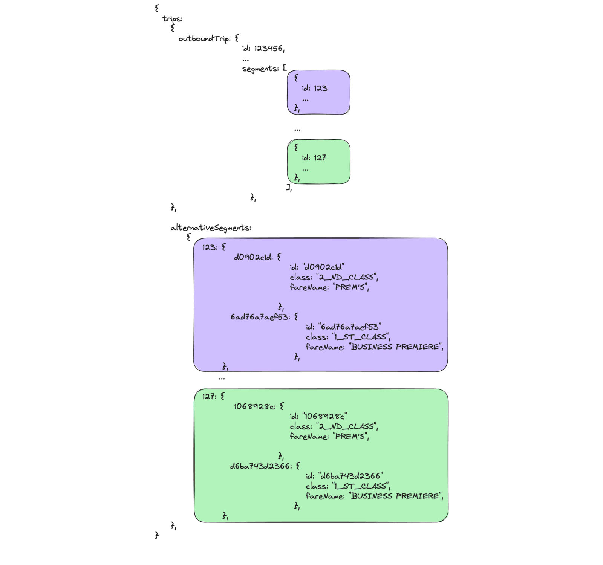

# Book

:::tip
You can use this [**POSTMAN collection**](../static/Tictactrip.postman_collection.json) to test the API.
:::

## 3. Create a cart
**[`POST /booking/v3/carts`](/api#operation/CreateCart)**

The first step to make a booking is to create a cart. It has to contain at least an `outboundTripId` which you can retrieve with a **[search](/docs/search)** and minimal passenger information for it to work.

```bash
curl --location --request POST 'https://api.tictactrip.eu/booking/v3/carts' \
--header 'Authorization: Bearer token' \
--header 'Content-Type: application/json' \
--data-raw '{
    "outboundTripId": "91c2b506-6667-46d4-ac7d-886b2a91cd01",
    "passengers": [
        {
            "age": 30,
            "discountCards": []
        }
    ]
}
'
```

### Response body example

```json
{
  "cart": {
    "id": "bf58e6091bd04eb2",
    "partnerId": null,
    "partnerExternalId": null,
    "paidPrice": 1420,
    "rawPrice": 1320,
    "trips": {
      "outboundTrip": {
        "id": "1165038",
        "uuid": "91c2b506-6667-46d4-ac7d-886b2a91cd01",
        "origin": {
          "id": 12709,
          "city": "Pralognan La Vanoise",
          "country": "France",
          "station": "PRALOGNAN LA VANOISE Airelles"
        },
        "destination": {
          "id": 549,
          "city": "Moûtiers",
          "country": "France",
          "station": "Moûtiers - Salins-les-Thermes - Brides-les-Bains"
        },
        "originOffset": "+0200",
        "destinationOffset": "+0200",
        "priceCents": 1420,
        "feeCents": 0,
        "paidPrice": 1420,
        "departureUTC": 1663561920,
        "arrivalUTC": 1663566300,
        "durationMinutes": 73,
        "companies": ["Altibus"],
        "segments": [
          {
            "id": "1764105",
            "company": "Altibus",
            "mean": "bus",
            "origin": {
              "city": "Pralognan La Vanoise",
              "country": "France",
              "station": "PRALOGNAN LA VANOISE Airelles",
              "lat": 45.3819,
              "long": 6.72121
            },
            "destination": {
              "city": "Moûtiers",
              "country": "France",
              "station": "Moûtiers - Salins-les-Thermes - Brides-les-Bains",
              "lat": 45.4852,
              "long": 6.5291
            },
            "isBookable": true,
            "priceCents": 1420,
            "feeCents": 100,
            "includedProviderFeeCents": 120,
            "departureUTC": 1663561920,
            "arrivalUTC": 1663566300,
            "originOffset": "+0200",
            "destinationOffset": "+0200",
            "durationMinutes": 73,
            "redirectionLink": "/redirect?company=21&trip=MOG577&date=19/09/2022&env=production"
          }
        ],
        "mean": "BUS",
        "co2g": 669
      }
    },
    "passengers": [
      {
        "id": 1445775,
        "lastName": null,
        "firstName": null,
        "title": null,
        "isCustomer": false,
        "discountCardId": null,
        "category": "adults",
        "discountCards": [],
        "age": 30,
        "birthdate": null
      }
    ]
  }
}
```

## 4. Update the cart
**[`PATCH /booking/v3/carts/{cart_id}`](/api#operation/UpdateCart)**

Now that you have created a cart, you will have to update it with the information of the passengers and the customer.  
You must pass the id of the cart **[previously created](/docs/book#3-create-a-cart)** as a parameter in the url.

:::tip
Some of our providers require governement issued IDs to be passed for each passenger in the identityDocument object.

Some of those carriers are the spanish companies RENFE and iryo.
A complete list can be found on this **[endpoint](/api#operation/GetSegmentProviders)** by looking at the `requiresIdentityDocument` field.
:::

```bash
curl --location --request PATCH 'https://api.tictactrip.eu/booking/v3/carts/bf58e6091bd04eb2' \
--header 'Authorization: Bearer token' \
--header 'Content-Type: application/json' \
--data-raw '{
    "passengers": [
        {
            "lastName": "lastName",
            "discountCards": [],
            "isCustomer": true,
            "title": "MR",
            "firstName": "firstName",
            "category": "adults",
            "age": 30,
            "birthdate": "1992-09-09"
        }
    ],
    "customer": {
        "lastName": "lastName",
        "mail": "mail@mail.com",
        "isSubscribedToNewsletter": false,
        "title": "MR",
        "firstName": "firstName",
        "birthdate": "1992-09-09"
    }
}'
```

### Response body example

```json
{
  "cart": {
    "id": "bf58e6091bd04eb2",
    "partnerId": null,
    "partnerExternalId": null,
    "paidPrice": 1180,
    "rawPrice": 1080,
    "trips": {
      //...
    },
    "passengers": [
      {
        "id": 1445778,
        "lastName": "lastName",
        "firstName": "firstName",
        "title": "MR",
        "isCustomer": true,
        "discountCardId": null,
        "category": "adults",
        "discountCards": [],
        "age": 30,
        "birthdate": "1992-09-09T00:00:00.000Z"
      }
    ],
    "customer": {
      "mail": "mail@mail.com",
      "title": "MR",
      "lastName": "lastName",
      "firstName": "firstName",
      "birthdate": "1992-09-09T00:00:00.000Z"
    }
  },
  "priceCentsDiff": 0,
  "isAvailable": true
}
```

:::caution

A price lookup is done everytime a cart is updated.

:::

### Select fare (optionnal)
**[`PATCH /booking/v3/carts/{cart_id}`](/api#operation/UpdateCart)**

:::caution

Fare selection is only available for Eurostar Thalys and SNCF brands on applicable journeys.

:::

When a cart is patched, all the fares available for each segment are stored in the alternativeSegments object. By default the lowest price is always selected.

You can choose your **fare**, segment by segment by mapping each `segment id` to its `fare id` in the **alternativeSegments** object.

The following example is based on this first patch response:



Let's say you want to book your first segment in first class, and your last one in second class. You must do the following request:


```
curl --location --request PATCH 'https://api.tictactrip.eu/booking/v3/carts/bf58e6091bd04eb2' \
--header 'Authorization: Bearer token' \
--header 'Content-Type: application/json' \
--data-raw '
{
    "segmentAlternatives": {
        123: "6ad76a7aef53",
        ...
        127: "1068928c"
    }
}'
```

:::caution

A price lookup is done everytime a cart is updated.

:::

### Response body example

```json
{
  "cart": {
    "id": "e8fcd9aec36c489d",
    "partnerId": "",
    "partnerExternalId": null,
    "paidPrice": 14200,
    "rawPrice": 14200,
    "totalPrice": 14200,
    "trips": {
      "outboundTrip": {
        "id": "1523320",
        "uuid": "c4c55711-2f93-4a21-b42a-87ab40f14833",
        "origin": {
          "id": 628,
          "city": "Paris",
          "country": "France",
          "station": "Paris Gare de Lyon"
        },
        "destination": {
          "id": 485,
          "city": "Lyon",
          "country": "France",
          "station": "Lyon Part Dieu"
        },
        "originOffset": "+0200",
        "destinationOffset": "+0200",
        "priceCents": 14200,
        "feeCents": 0,
        "paidPrice": 14200,
        "departureUTC": 1686590640,
        "arrivalUTC": 1686597720,
        "durationMinutes": 118,
        "companies": [
          "TGV Inoui"
        ],
        "segments": [
          {
            "id": "2325470",
            "company": "TGV Inoui",
            "mean": "train",
            "origin": {
              "city": "Paris",
              "country": "France",
              "station": "Paris Gare de Lyon",
              "lat": 48.8566,
              "long": 2.3515
            },
            "destination": {
              "city": "Lyon",
              "country": "France",
              "station": "Lyon Part Dieu",
              "lat": 45.764043,
              "long": 4.835659
            },
            "isBookable": true,
            "priceCents": 14200,
            "feeCents": 0,
            "includedProviderFeeCents": 0,
            "departureUTC": 1686590640,
            "arrivalUTC": 1686597720,
            "originOffset": "+0200",
            "destinationOffset": "+0200",
            "durationMinutes": 118,
            "redirectionLink": null,
            "bookingClass": "1ère classe",
            "fareName": "BUSINESS PREMIERE",
            "conditions": [
              "Echange et remboursement sans frais jusqu'à 30 min après départ.",
              "Dès 30 min avant départ, billet échangeable 2 fois max (même jour, même trajet) et non remboursable après 1 échange.",
              "Si emprunt d’un autre train, échange obligatoire."
            ],
            "vehicleIdentifier": "6669"
          }
        ],
        "mean": "TRAIN",
        "co2g": 150
      }
    },
    "passengers": [
      {
        "id": 1880413,
        "lastName": "Doe",
        "firstName": "John",
        "title": "MR",
        "isCustomer": true,
        "discountCardId": null,
        "category": "youths",
        "discountCards": [],
        "age": 24,
        "birthdate": "1999-01-01T00:00:00.000Z"
      }
    ],
    "customer": {
      "mail": "john.doe@tictactrip.eu",
      "title": "MR",
      "lastName": "Doe",
      "firstName": "John",
      "birthdate": "1999-01-01T00:00:00.000Z"
    }
  },
  "priceCentsDiff": 0,
  "isAvailable": true,
  "segmentAlternatives": {
    "2325470": {
      "e1429d43-91a5-47ac-824a-1630f39cf076": {
        "id": "e1429d43-91a5-47ac-824a-1630f39cf076",
        "arrivalOffset": "+0200",
        "arrivalUnixUtc": 1686597720,
        "bookingClass": "2_ND_CLASS",
        "brandName": "TGV INOUI",
        "co2g": 150,
        "conditions": [
          "Billet échangeable (ajustement au tarif en vigueur) et remboursable uniquement avant départ : 19 € de frais dès 6 jours avant départ.",
          "Dès 30 min avant départ, billet échangeable 2 fois max (même jour, même trajet) et non remboursable après 1 échange."
        ],
        "departureOffset": "+0200",
        "departureUnixUtc": 1686590640,
        "destinationProviderStopId": "FRUQQ",
        "fareName": "PREM'S",
        "durationMinutes": 118,
        "feeCents": 0,
        "providerId": "18",
        "includedProviderFeeCents": 0,
        "isAvailable": true,
        "isBookable": true,
        "originProviderStopId": "FRPLY",
        "priceCents": 2500,
        "segmentProviderBrandId": "VSC",
        "segmentProviderId": 10,
        "transportType": "train",
        "vehicleIdentifier": "6669",
        "segmentProviderSegmentRefId": "ea4642de-aab7-4cce-a85d-7fb7256564b4",
        "includedBaggage": true,
        "notAvailableReason": null
      },
      "4052b766-94c4-4e1d-851b-c0e0b312ea28": {
        "id": "4052b766-94c4-4e1d-851b-c0e0b312ea28",
        "arrivalOffset": "+0200",
        "arrivalUnixUtc": 1686597720,
        "bookingClass": "1_ST_CLASS",
        "brandName": "TGV INOUI",
        "co2g": 150,
        "conditions": [
          "Echange et remboursement sans frais jusqu'à 30 min après départ.",
          "Dès 30 min avant départ, billet échangeable 2 fois max (même jour, même trajet) et non remboursable après 1 échange.",
          "Si emprunt d’un autre train, échange obligatoire."
        ],
        "departureOffset": "+0200",
        "departureUnixUtc": 1686590640,
        "destinationProviderStopId": "FRUQQ",
        "fareName": "BUSINESS PREMIERE",
        "durationMinutes": 118,
        "feeCents": 0,
        "providerId": "18",
        "includedProviderFeeCents": 0,
        "isAvailable": true,
        "isBookable": true,
        "originProviderStopId": "FRPLY",
        "priceCents": 14200,
        "segmentProviderBrandId": "VSC",
        "segmentProviderId": 10,
        "transportType": "train",
        "vehicleIdentifier": "6669",
        "segmentProviderSegmentRefId": "6266132b-fe0c-421c-a821-9cef60c71fbf",
        "includedBaggage": true,
        "notAvailableReason": null
      }
    }
  }
}
```

## 5. Create an order
**[`POST /booking/v3/orders`](/api#operation/CreateOrder)**

The creation of an order is done from a cart, so you will not be able to create an order if you have not **[created](/docs/book#3-create-a-cart)** and **[updated](/docs/book#4-update-the-cart)** the cart before.  
You must pass the `cartId` in the body of the request.

```bash
curl --location --request POST 'https://api.tictactrip.eu/booking/v3/orders' \
--header 'Authorization: Bearer token' \
--header 'Content-Type: application/json' \
--data-raw '{
    "cartId": "bf58e6091bd04eb2"
}'
```

### Response body example

```json
{
  "order": {
    "id": "fde73760a5354d18",
    "orderDate": "2022-09-13T13:59:06.070Z",
    "cartId": "bf58e6091bd04eb2",
    "orderStatus": "CREATED",
    "trips": {
      //...
    },
    "passengers": [
      {
        //...
      }
    ],
    "customer": {
      //...
    },
    "paymentStatus": "ACCEPTED"
  },
  "priceCentsDiff": 0,
  "isAvailable": true,
  "expiresAt": "2022-09-13T14:14:06.070Z"
}
```

:::info

When creating an order an option is placed on the ticket(s). Depending of the company selling the ticket(s), the time at which the availability and price is guaranted may vary.

:::

## 6. Book an order
**[`POST /booking/v3/orders/{order_id}/book`](/api#operation/CreateBook)**

The booking is done asynchronously from an **[order](/docs/book#6-create-an-order)**.  
You must pass the id of the order **[previously created](/docs/book#6-create-an-order)** as a parameter in the url.

```bash
curl --location --request POST 'https://api.tictactrip.eu/booking/v3/orders/fde73760a5354d18/book' \
--header 'Authorization: Bearer token'
```

### Response body example

```json
{
  "order": {
    "id": "fde73760a5354d18",
    "rawPrice": 1080,
    "paidPrice": 1180,
    "totalPrice": 1180,
    "orderDate": "2022-09-13T15:54:21.975Z",
    "cartId": "bf58e6091bd04eb2",
    "orderStatus": "PENDING_BOOKING",
    "trips": {
      //...
    },
    "passengers": [
      {
        //...
      }
    ],
    "customer": {
      //...
    },
    "paymentStatus": "ACCEPTED"
  }
}
```

:::tip

Check the full description of this **[request](/api#operation/CreateBook)**.

:::

## 7. Get an order status
**[`GET /booking/v3/orders/{order_id}`](/api#operation/GetOrder)**

As the booking is done asynchronously, you have to call this endpoint to know if the booking was successful or not.  
If the `orderStatus` is set to `SUCCESS`, then the booking went well.

```bash
curl --location --request GET 'https://api.tictactrip.eu/booking/v3/orders/fde73760a5354d18' \
--header 'Authorization: Bearer token'
```

### Response body example

```json
{
  "order": {
    "id": "fde73760a5354d18",
    "rawPrice": 1080,
    "paidPrice": 1180,
    "totalPrice": 1180,
    "orderDate": "2022-09-13T15:54:21.975Z",
    "cartId": "bf58e6091bd04eb2",
    "orderStatus": "SUCCESS",
    "trips": {
      //...
    },
    "passengers": [
      {
        //...
      }
    ],
    "customer": {
      //...
    },
    "paymentStatus": "ACCEPTED"
  }
}
```

:::info

A booking can be long, it may be necessary to call this endpoint several times.

:::

## 8. Download tickets
**[`GET /booking/v3/orders/{order_id/ticket?filename={file_name}`](/api#operation/DownloadTicket)**

Once you have validated that the booking was successful by **[getting the order](/docs/book#8-get-an-order-status)** you can download the tickets of the order.
You must pass the id of the order and the file name you want to give to the file as a parameter in the url.

```bash
curl --location --request GET 'https://api.tictactrip.eu/booking/v3/orders/fde73760a5354d18/ticket?filename=ticketName' \
--header 'Authorization: Bearer token'
```

### Response body example


:::info

If there are several tickets in the order, they will all be in the same pdf.

:::

## Ticket cancellation
### Get cancellation conditions
**[`GET /booking/v3/orderTickets/{order_id}/cancellation/conditions`](/api#operation/PartnerCancellationConditions)**

We offer ticket cancellation on a per segment basis, for all the passengers. This is two step process, you will first ask for cancellations conditions and then cancel the ticket if you wish.

To retrieve the cancellation conditions, you must pass the id of the segment you want to cancel. It can be found in the [order summary](/api#operation/GetOrder).

This endpoint will provide:

- A `refundable` field which is a boolean indicating if the ticket is cancellable or not.
- A `feeCents` field which corresponds to the fees the carrier will apply if you cancel the ticket.
- A `cutoff` field providing the date and time until which you can cancel the ticket with the given conditions.
- An `isRefundedByVoucher` field indicating if the refund will be done by voucher or cash. Be aware that those vouchers aren't usable on Tictactrip's inventory but only for the carrier that issued them.

### Request example for cancellation conditions retrieval

**Request:**

```bash
curl --location 'https://api.tictactrip.eu/booking/v3/orderTickets/496315/cancellation/conditions' \
--header 'Authorization: Bearer' \
--header 'Content-Type: application/json'
```

**Response:**

```json
{
  "isCancellable": true,
  "feeCents": 0,
  "cutoff": "2023-05-26T14:00:00.000Z",
  "bookingId": "Q6NX4V",
  "isRefundedByVoucher": false
}
```

If the provided conditions are acceptable, you can then cancel the ticket by calling the next endpoint.

:::tip

Check the full description of this **[request](/api#operation/partnerCancellationConditions)**.

:::

### Request a ticket cancellation
**[`PUT /booking/v3/orderTickets/{order_id}/cancellation`](/api#operation/PartnerCancelBooking)**

### Request example for a segment cancellation

**Request:**

```bash
curl --location --request PUT 'https://api.tictactrip.eu/booking/v3/orderTickets/496315/cancellation' \
--header 'Authorization: Bearer' \
--header 'Content-Type: application/json' \
--data ''
```

**Response:**

```bash
{
    "createdAt": "2023-05-26T14:33:28.338Z",
    "id": 3184,
    "orderTicketCancellationId": 2153,
    "refundedAmountCents": null,
    "message": null,
    "status": "INPROGRESS",
    "refundType": null,
    "refundExpirationDateUtc": null,
    "updatedAt": "2023-05-26T14:33:28.335Z",
    "deletedAt": null
}
```

:::tip
As for bookings cancellations are treated asynchronously, you can check the [order summary](/api#operation/GetOrder) endpoint to know if the cancellation was successful or not.
:::

:::info
The [order summary](/api#operation/GetOrder) returns the current status of an Order with the `orderStatus` property. In case of cancellation, the `orderStatus` may either be `CANCELED` or `CANCELED_PARTIAL`. The `CANCELED_PARTIAL` status means that at least one [segment](/docs/glossary#segment) of the order has been canceled but not all of them. The `orderStatus` is `CANCELED` only when all [segments](/docs/glossary#segment) of the order have been canceled and/or refunded.
:::

:::info
On the other hand, the current status of a [segments](/docs/glossary#segment)  is given by the `bookingStatus` property. In case of cancellation, the status of a [segments](/docs/glossary#segment) may either be `CANCELED` or `REFUNDED`. The `CANCELED` status means that the cancellation of the [segments](/docs/glossary#segment) is successful. At this point, the cancellation may lead to a refund with a voucher or a refund with a wire transfer. Only in case of wire transfer and only if the call for a wire transfer is successful, the `bookingStatus` will be `REFUNDED`.

In case of cancellation, another property is available on the [segments](/docs/glossary#segment). `cancellationStatus` may also be used to keep track of the current status of the cancellation. Its possible values are `INPROGRESS`, `ACCEPTED`, `REFUNDED` and `ERRORED`:

- `INPROGRESS` when the cancellation is still being processed.
- `ACCEPTED` when the cancellation is successful. Terminal status in case of refund with a voucher.
- `REFUNDED` when the cancellation is successful and refunded with a wire transfer.
- If ever an error occurs during the cancellation process, the `bookingStatus` will stay at its latest know status and the `cancellationStatus` will be set to `ERRORED`.
:::
