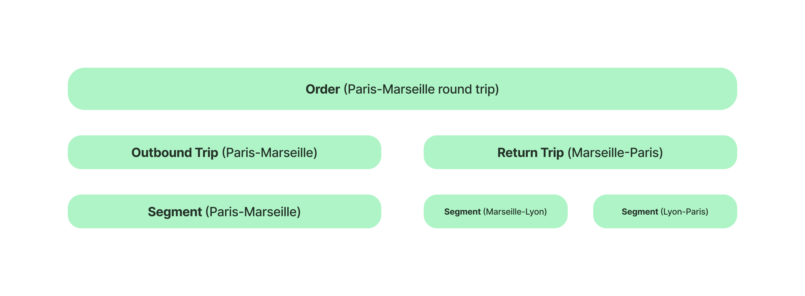

# Glossary

## Trip

### Definition


A **trip** represents a travel, typically there are two trips for a round trip and a single one for a one-way. A **trip** consist of one or several **[Segments](/docs/glossary#segment)**.


### Example

I make a trip from Paris to Brussels, it contains two **[Segments](/docs/glossary#segment)**, Paris - Lille by Ouigo then Lille - Brussels by Flixbus.

This combination of **[Segments](/docs/glossary#segment)** constitutes a **trip**.

```json
{
  "trips": {
    "outboundTrip": {
      "id": "1164994",
      "uuid": "6c5685e2-4132-4025-b602-ed984ea7934f",
      "origin": {
        "id": 628,
        "city": "Paris",
        "country": "France",
        "station": "Marne-la-Vallée Chessy Disneyland Paris"
      },
      "destination": {
        "id": 1061,
        "city": "Bruxelles",
        "country": "Belgique",
        "station": "Brussels, Brussels-North station"
      },
      "originOffset": "+0200",
      "destinationOffset": "+0200",
      "priceCents": 3299,
      "feeCents": 600,
      "paidPrice": 3299,
      "departureUTC": 1662722580,
      "arrivalUTC": 1662739200,
      "durationMinutes": 277,
      "companies": ["OUIGO Grande vitesse", "Flixbus"],
      "segments": [
        {
          "id": "1764044",
          "company": "OUIGO Grande vitesse",
          "mean": "train",
          "origin": {
            "city": "Paris",
            "country": "France",
            "station": "Marne-la-Vallée Chessy Disneyland Paris",
            "lat": 48.8566,
            "long": 2.3515
          },
          "destination": {
            "city": "Lille",
            "country": "France",
            "station": "Lille Flandres",
            "lat": 50.638756,
            "long": 3.076675
          },
          "isBookable": true,
          "priceCents": 1700,
          "feeCents": 100,
          "includedProviderFeeCents": 0,
          "departureUTC": 1662722580,
          "arrivalUTC": 1662726840,
          "originOffset": "+0200",
          "destinationOffset": "+0200",
          "durationMinutes": 71,
          "redirectionLink": "/redirect?company=13&origin=PT1&destination=AD1&date=2022-09-09&passengers=%5B%7B%22type%22%3A%22A%22%2C%22disability_type%22%3A%22NH%22%7D%5D&env=production"
        },
        {
          "id": "1764045",
          "company": "Flixbus",
          "mean": "bus",
          "origin": {
            "city": "Lille",
            "country": "France",
            "station": "Lille",
            "lat": 50.638756,
            "long": 3.076675
          },
          "destination": {
            "city": "Bruxelles",
            "country": "Belgique",
            "station": "Brussels, Brussels-North station",
            "lat": 50.834999,
            "long": 4.33264
          },
          "isBookable": true,
          "priceCents": 999,
          "feeCents": 0,
          "includedProviderFeeCents": 0,
          "departureUTC": 1662733200,
          "arrivalUTC": 1662739200,
          "originOffset": "+0200",
          "destinationOffset": "+0200",
          "durationMinutes": 100,
          "redirectionLink": "/redirect?company=5&origin=2215&destination=1785&date=09.09.2022&passengers=%7B%22adult%22%3A1%2C%22children%22%3A0%7D&env=production"
        }
      ],
      "mean": "MULTIMODAL",
      "co2g": 3493
    }
  }
}
```

## Segment

### Definition

A **Segment** is a subpart of a **Trip**. It has an origin (city and station), a destination (city and station), a price, a date, hours.

### Example

A train that leaves Paris Gare De Lyon at 5:37 pm on september 8, 2022 and arrives in Marseille St Charles at 8:57 pm on september 8, 2022 for 79€ is a Segment.
Indeed we have a city (Paris), a station (Paris Gare De Lyon), a date (september 8, 2022), a time (5:37 pm and 8:57 pm) and a price (79€).

```json
{
  "segments": [
    {
      "id": "1764020",
      "company": "Sncf Connect",
      "mean": "train",
      "origin": {
        "city": "Paris",
        "country": "France",
        "station": "Paris Gare De Lyon",
        "lat": 45.3819,
        "long": 6.72121
      },
      "destination": {
        "city": "Marseille",
        "country": "France",
        "station": "Marseilles St Charles",
        "lat": 45.4852,
        "long": 6.5291
      },
      "isBookable": true,
      "priceCents": 7900,
      "feeCents": 0,
      "departureUTC": 1662651420,
      "arrivalUTC": 1662663420,
      "durationMinutes": 200
      //...
    }
  ]
}
```

## StopGroup

### Definition

A **stopGroup** is a set of stations. In "real world" semantics, a **stopGroup** matches a physical station, or several kinds of stations in the same real world location.

### Example

A **stopGroup** "Paris Bercy" has two stations being the "train station" and the "bus station", but in practice, the user only wants to know about "Paris Bercy" as a transportation hub. Thus, we group them under a single entity named **stopGroup**.
A stopGroup looks like `g|FRpariberc@u09ty4`.

```json
{
  "id": "g|FRpariberc@u09ty4",
  "name": "Paris Bercy ",
  "city": "Paris",
  "region": "Île-de-France",
  "country": "FR",
  "latitude": 48.8393,
  "longitude": 2.3829,
  "transportTypes": ["bus", "train"]
  //...
}
```

## StopCluster

### Definition

A **stopCluster** is a collection of **[stopGroups](/docs/glossary#stopgroup)**. It corresponds to a user intent. It is often illustrated by a city, but it can be anything the user is supposed to be looking for.
A stop cluster looks like `c|FRparis___@u09tv`.

### Example

"Paris" and "Disneyland Paris" are **stopClusters**.

```json
{
  "id": "c|FRparis___@u09tv",
  "name": "Paris",
  "city": "Paris",
  "region": "Île-de-France",
  "country": "FR",
  "latitude": 48.8566,
  "longitude": 2.3515
  //...
}
```

## Place ID
### Definition

The name of a stopCluster or a stopGroup is not unique. For example, there are several "Paris" in the world. To avoid ambiguity, we use a unique identifier for each place. It is called a place ID.

### Example
`c|FRparis___@u09tv`

The place ID is made of:
- Stop type: `c|` or `g|`
- Country code: `FR`
- Place name in 8 characters: `paris___`
- Geohash: `@u9tv`
